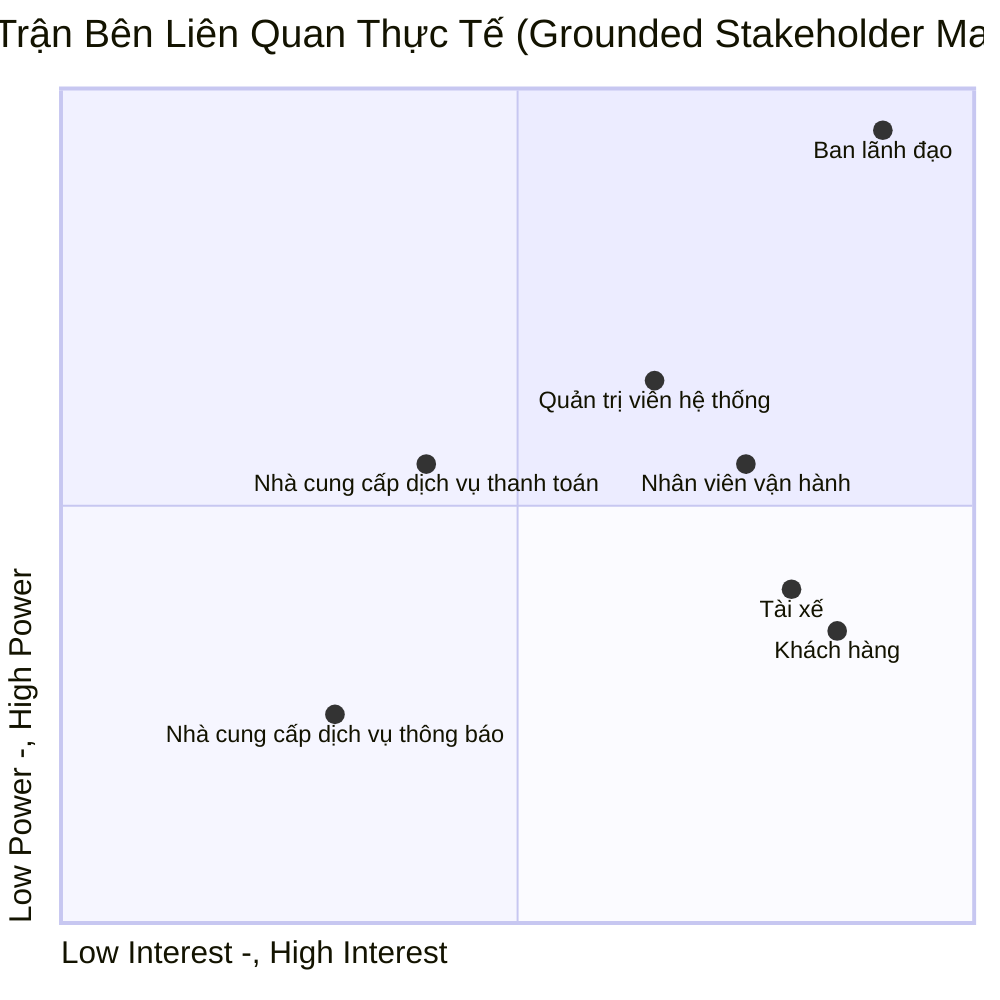
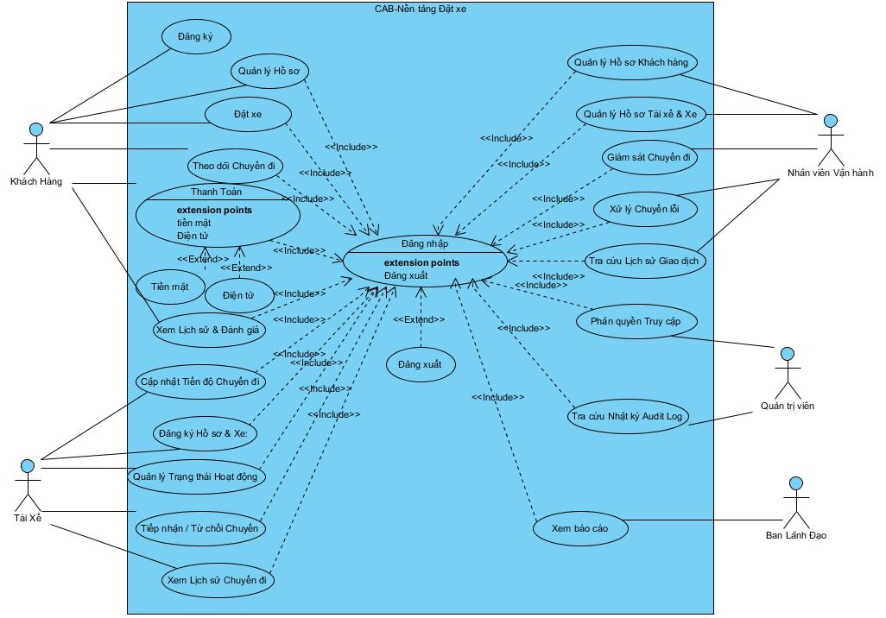

# 23642081_TRANBICHTHUAN_CABSYSTEM
# Bước 1: Xác định yêu cầu hệ thống:
* **Tên hệ thống:** CAB System – Nền tảng đặt xe

* **Vấn đề hệ thống hiện tại:** Hệ thống hiện tại còn nhiều hạn chế như phân công tài xế chủ yếu thủ công, khách hàng khó theo dõi trạng thái chuyến đi, thông tin thanh toán chưa được quản lý tập trung và hệ thống khó mở rộng khi số lượng khách hàng, tài xế tăng lên. Do đó, doanh nghiệp cần xây dựng một nền tảng CAB mới để tự động hóa và nâng cao hiệu quả vận hành.

* **Mục tiêu:** Xây dựng một nền tảng đặt xe trực tuyến giúp khách hàng đặt xe, hệ thống tự động tìm và phân công tài xế, hỗ trợ tài xế thực hiện chuyến, thanh toán và thông báo, đồng thời cung cấp giao diện quản trị cho nhân viên vận hành. Hệ thống được định hướng trở thành một nền tảng CAB có khả năng mở rộng lâu dài, không chỉ đáp ứng nhu cầu đặt xe hiện tại mà còn cho phép bổ sung loại dịch vụ, phương thức thanh toán, nhà cung cấp thông báo và các thành phần kỹ thuật trong tương lai.

# Bước 2: Xác định các bên liên quan:
| Tên | Vai trò |
|---|---|
| Ban lãnh đạo | Theo dõi hoạt động kinh doanh thông qua các báo cáo về số lượng chuyến, doanh thu, tỷ lệ hoàn thành, tỷ lệ hủy và hiệu quả tài xế. |
| Khách hàng | Người sử dụng dịch vụ; đăng ký, đặt xe, theo dõi chuyến, thanh toán, xem lịch sử và đánh giá tài xế. |
| Tài xế | Nhận và thực hiện chuyến xe; quản lý hồ sơ, phương tiện, trạng thái hoạt động, cập nhật trạng thái chuyến đi, chia sẻ vị trí và hoàn thành chuyến. |
| Nhân viên vận hành | Quản lý hoạt động đặt xe và điều phối; theo dõi chuyến, trạng thái tài xế, xử lý chuyến lỗi và hỗ trợ điều phối khi cần. |
| Quản trị viên hệ thống | Quản lý tài khoản, phân quyền, cấu hình và các hoạt động quản trị kỹ thuật của hệ thống. |
| Nhà cung cấp dịch vụ thanh toán | Xử lý các giao dịch thanh toán điện tử và trả kết quả giao dịch cho CAB System. |
| Nhà cung cấp dịch vụ thông báo | Gửi thông báo đến khách hàng và tài xế qua các kênh như Push Notification, SMS hoặc Email. |
## Stakeholder Matrix:

# Bước 3: Mục đích kinh doanh (Business Purpose):
Mục đích	Ý nghĩa kinh doanh

**1. Tự động hóa & Số hóa:** Chuẩn hóa và tự động hóa toàn bộ quy trình cung cấp dịch vụ: từ khâu tiếp nhận yêu cầu đặt xe, tìm kiếm & điều phối tài xế tự động, thực hiện hành trình, tính cước, xử lý thanh toán, gửi thông báo thời gian thực đến thu thập phản hồi đánh giá của khách hàng. Đồng thời cho phép khách hàng theo dõi tài xế, trạng thái chuyến và ETA

**2. Hỗ trợ ra quyết định dựa trên dữ liệu:** Tập trung hóa và chuẩn hóa toàn bộ dữ liệu giao dịch, hành trình và vận hành. Đảm bảo các bộ phận có đủ dữ liệu chính xác để theo dõi hoạt động, đồng thời cung cấp cho Ban lãnh đạo hệ thống báo cáo trực quan về hiệu suất kinh doanh (doanh thu, số lượng chuyến, tỷ lệ hoàn thành, tỷ lệ hủy và hiệu quả hoạt động của tài xế), làm cơ sở đưa ra các quyết định chiến lược và điều chỉnh chính sách kịp thời.

**3. Tối ưu năng lực phục vụ tải lớn:** Xây dựng một nền tảng mạnh mẽ có khả năng phục vụ đồng thời số lượng lớn khách hàng và đối tác tài xế, đảm bảo hệ thống vận hành liên tục, ổn định ngay cả vào các khung giờ cao điểm có nhu cầu tăng cao.

**4. Xây dựng nền tảng phát triển dài hạn:** Sở hữu một giải pháp công nghệ có cấu trúc linh hoạt, có khả năng mở rộng độc lập và triển khai từng phần, dễ dàng bổ sung thêm các loại dịch vụ mới, tích hợp thêm cổng thanh toán hoặc thay đổi nhà cung cấp dịch vụ thông báo trong tương lai mà không cần phải tái cấu trúc toàn bộ hệ thống.

**5. Tối ưu hóa vận hành thời gian thực:** Cung cấp cho bộ phận vận hành giao diện quản trị tập trung để theo dõi sát sao các chuyến đi đang diễn ra, kiểm tra trạng thái hoạt động thực tế của tài xế và hỗ trợ can thiệp, xử lý kịp thời các trường hợp chuyến đi bị lỗi ngay khi sự cố phát sinh theo thời gian thực.

**6. Tăng cường an toàn, kiểm soát và bảo mật:**	Xác thực & Phân quyền chặt chẽ, bảo vệ dữ liệu và lưu vết các thao tác quan trọng

# Bước 4: Xác định phạm vi:

 | Nhóm chức năng | Mô tả phạm vi  | Ghi chú kỹ thuật & Nghiệp vụ |
| :--- | :--- | :--- |
| **Quản lý tài khoản & Xác thực** | • Khách hàng tự đăng ký tài khoản, đăng nhập và cập nhật thông tin cá nhân. • Tài xế đăng ký hoặc được nhân viên vận hành tạo tài khoản, cập nhật hồ sơ, thông tin phương tiện và trạng thái hoạt động. • Khách hàng và tài xế bắt buộc phải được xác thực trước khi sử dụng các chức năng yêu cầu tài khoản. | Yêu cầu an toàn thông tin cơ bản để bảo vệ thông tin cá nhân và dữ liệu giao dịch. |
| **Đặt xe** | • Khách hàng nhập thông tin điểm đón, điểm đến, lựa chọn loại xe và gửi yêu cầu đặt xe. | Luồng tạo yêu cầu dịch vụ cốt lõi. |
| **Tìm & Phân công tài xế** | • Hệ thống tự động quét và xác định danh sách tài xế phù hợp dựa trên vị trí, trạng thái sẵn sàng và loại xe. • **Cơ chế tự động chuyển tiếp:** Nếu tài xế được đề xuất đầu tiên từ chối hoặc không phản hồi (timeout), hệ thống tự động tìm và chuyển yêu cầu sang tài xế tiếp theo mà không bắt khách hàng đặt lại. • Nếu không tìm được tài xế, hệ thống gửi thông báo rõ ràng cho khách hàng. | Thuật toán chạy ngầm, cần được tối ưu xử lý bất đồng bộ để tránh tắc nghẽn luồng đặt xe cốt lõi. |
| **Quản lý chuyến đi** | • Khách hàng biết trạng thái hệ thống đang tìm tài xế, tài xế nào đã nhận chuyến, thời gian dự kiến đến và trạng thái chuyến đi. • Tài xế cập nhật trạng thái theo từng giai đoạn: đã đến điểm đón, đã đón khách, đang di chuyển và hoàn thành chuyến. | Khắc phục hạn chế của hệ thống cũ, giúp khách hàng chủ động theo dõi hành trình thời gian thực. |
| **Vị trí tài xế** | • Hệ thống lưu thông tin vị trí của tài xế để hỗ trợ tìm tài xế gần khách hàng và ước tính thời gian đến. • *Không tích hợp bản đồ trực quan (Map Provider) trên giao diện ứng dụng ở giai đoạn này.* | Lưu trữ vị trí trực tiếp vào cơ sở dữ liệu để tính khoảng cách toán học thuần túy (như công thức Haversine) giữa các tọa độ, tiết kiệm thời gian tích hợp API bản đồ. |
| **Tính cước** | • Tự động xác định số tiền khách hàng phải trả dựa trên loại dịch vụ và thông tin chuyến đi ngay khi hoàn thành. | Áp dụng công thức tính cước tối giản của MVP do quy tắc tính cước chi tiết hiện chưa được doanh nghiệp thống nhất. |
| **Thanh toán** | • Hỗ trợ thanh toán bằng tiền mặt hoặc thanh toán điện tử. • Tích hợp với **01 nhà cung cấp cổng thanh toán điện tử duy nhất**. • **Tuyệt đối không lưu trữ thông tin nhạy cảm** của thẻ hoặc tài khoản thanh toán trên hệ thống CAB. • Nếu giao dịch điện tử thất bại, thông báo cho khách hàng và cho phép xử lý lại theo chính sách của doanh nghiệp. | Đảm bảo tính bảo mật và toàn vẹn của dữ liệu giao dịch tài chính. |
| **Thông báo** | • Gửi thông báo tự động cho khách hàng tại các điểm chạm cốt lõi (Tiếp nhận đặt xe, Có tài xế nhận, Tài xế đến điểm đón, Chuyến hoàn thành, Kết quả thanh toán). • Gửi thông báo cho tài xế về chuyến mới hoặc các thay đổi liên quan đến chuyến đang thực hiện. | Module thông báo được thiết kế độc lập để dễ dàng mở rộng thêm các kênh mới trong tương lai mà không phải thay đổi toàn hệ thống. |
| **Lịch sử & Đánh giá** | • Khách hàng xem lại lịch sử chuyến đi, số tiền đã trả. • Khách hàng thực hiện đánh giá (Rating) chất lượng dịch vụ của tài xế sau khi hoàn thành chuyến. | Thu thập phản hồi chất lượng dịch vụ phục vụ công tác nâng cao trải nghiệm. |
| **Quản lý vận hành** | • Giao diện quản trị giúp nhân viên vận hành quản lý khách hàng, tài xế, phương tiện và chuyến đi. • Xem danh sách các chuyến đi đang diễn ra, trạng thái hoạt động của tài xế và tra cứu lịch sử giao dịch. • Cung cấp tính năng hỗ trợ xử lý các trường hợp chuyến đi bị lỗi kỹ thuật hoặc nghiệp vụ . | Phục vụ hoạt động điều phối, kiểm soát hàng ngày và hỗ trợ khách hàng của phòng vận hành. |
| **Phân quyền (RBAC)** | • Kiểm soát quyền truy cập đối với các chức năng quản trị. • Phân quyền rõ ràng để nhân viên vận hành thông thường không thể thực hiện các thao tác nhạy cảm. | Đảm bảo an toàn vận hành, tránh rủi ro thao tác sai lệch dữ liệu quản trị. |
| **Audit Log** | • Ghi nhận và lưu vết toàn bộ các thao tác quản trị quan trọng. | Yêu cầu bảo mật bắt buộc để phục vụ công tác kiểm tra, đối soát khi xảy ra sự cố. |
| **Báo cáo cơ bản** | • Cung cấp báo cáo về số lượng chuyến, doanh thu, tỷ lệ chuyến hoàn thành và tỷ lệ hủy. | Hỗ trợ Ban lãnh đạo theo dõi hiệu quả hoạt động kinh doanh và hiệu quả hoạt động của tài xế. |

---
# Bước 5: Chuyển các yêu cầu thành yêu cầu nghiệp vụ (Business Requirements):
## Danh sách Yêu cầu Nghiệp vụ (BR)

---

| Mã BR | Yêu cầu Nghiệp vụ cốt lõi | KPI & Tiêu chí Nghiệm thu cụ thể |
| :--- | :--- | :--- |
| **BR-01** | Tự động hóa ghép chuyến & Phân công tài xế | • **100%** luồng phân công chạy tự động, không cần tổng đài can thiệp. • Thời gian phản hồi ghép chuyến $\le$ **15s/vòng quét**. • Tự động chuyển tiếp tìm tài xế khác khi tài xế trước từ chối hoặc timeout mà không bắt khách tạo lại chuyến. |
| **BR-02** | Minh bạch hành trình & Trạng thái real-time | • Hiển thị chuẩn xác **5 trạng thái** vòng đời chuyến đi (*Tìm tài xế, Đã nhận chuyến, Đến điểm đón, Đang di chuyển, Hoàn thành*). • Cập nhật thời gian dự kiến đến (ETA) với sai số $\le$ **$\pm$ 3 phút**. • Tự động gửi **100%** thông báo đẩy (Push/SMS) đúng 5 mốc sự kiện cốt lõi. |
| **BR-03** | Chuẩn hóa & An toàn luồng Thanh toán | • Tự động tính cước chính xác ngay khi hoàn thành chuyến đi. • **0%** lưu trữ thông tin thẻ nhạy cảm (CVV, số thẻ đầy đủ) trên hệ thống CAB. • Cho phép khách hàng chọn thanh toán lại (Retry) hoặc đổi sang tiền mặt ngay khi giao dịch điện tử thất bại. |
| **BR-04** | Giám sát & Xử lý sự cố Vận hành | • Nhân viên vận hành có thể tra cứu và can thiệp xử lý chuyến lỗi trong vòng $\le$ **2 phút**. • **100%** thao tác nhạy cảm của nhân viên (phân quyền, chỉnh sửa dữ liệu) phải được lưu Audit Log đầy đủ. |
| **BR-05** | Hệ thống Báo cáo Quản trị | • Cung cấp đủ 5 nhóm chỉ số: *Doanh thu, Số lượng chuyến, Tỷ lệ hoàn thành, Tỷ lệ hủy, KPI hiệu suất tài xế*. • Tốc độ xuất báo cáo dữ liệu trong vòng 30 ngày đạt $\le$ **5 giây**. |
| **BR-06** | Cách ly lỗi & Khả năng Mở rộng | • **0% Downtime** luồng Đặt xe cốt lõi khi Module Thanh toán hoặc Thông báo gặp sự cố kỹ thuật. • Kiến trúc linh hoạt, cho phép cắm/rút cổng thanh toán hoặc thêm loại dịch vụ mới mà không phải làm lại hệ thống. |

# Bước 6: Phân rã các yêu cầu chức năng (Functional Requirements):

---

## 1. Actor: Khách hàng

* **Đăng ký & Đăng nhập:** Khách hàng đăng ký/đăng nhập tài khoản bằng Số điện thoại + OTP.
* **Quản lý Hồ sơ:** Khách hàng xem và cập nhật thông tin cá nhân (Họ tên, Email).
* **Đặt xe:** Khách hàng nhập Điểm đón, Điểm đến, chọn Loại xe và xem Giá cước dự kiến trước khi xác nhận đặt xe.
* **Theo dõi Chuyến đi:** Khách hàng xem trạng thái chuyến đi, vị trí tài xế di chuyển và Thời gian dự kiến đến (ETA).
* **Thanh toán** Khách hàng thực hiện thanh toán qua Cổng điện tử hoặc Tiền mặt.
* **Xem Lịch sử & Đánh giá:** Khách hàng tra cứu lịch sử chuyến đi và chấm điểm sao (1-5 sao) kèm nhận xét về tài xế.

## 2. Actor: Tài xế

* **Đăng ký Hồ sơ & Xe:** Tài xế tự đăng ký tài khoản, cập nhật hồ sơ cá nhân và thông tin phương tiện (Biển số, Loại xe).
* **Quản lý Trạng thái Hoạt động:** Tài xế chuyển đổi trạng thái "Sẵn sàng nhận chuyến" hoặc "Tắt ứng dụng".
* **Tiếp nhận / Từ chối Chuyến:** Tài xế nhận thông báo chuyến đi mới và bấm Chấp nhận hoặc Từ chối trong thời gian quy định.
* **Cập nhật Tiến độ Chuyến đi:** Tài xế cập nhật trạng thái theo luồng: *Đã đến điểm đón , Đã đón khách , Hoàn thành chuyến*.
* **Xem Lịch sử Chuyến đi:** Tài xế tra cứu các chuyến đã thực hiện và tổng số tiền thu nhập.

## 3. Actor: Nhân viên Vận hành 

* **Quản lý Hồ sơ Khách hàng:** Tìm kiếm, xem chi tiết thông tin tài khoản Khách hàng.
* **Quản lý Hồ sơ Tài xế & Xe:** Tạo mới tài khoản Tài xế, cập nhật hồ sơ và thông tin phương tiện (biển số, loại xe).
* **Giám sát Chuyến đi:** Theo dõi danh sách các chuyến đi đang diễn ra và vị trí/trạng thái thực tế của Tài xế.
* **Xử lý Chuyến lỗi:** Can thiệp hủy chuyến hoặc điều chỉnh trạng thái khi chuyến đi gặp sự cố kỹ thuật/nghiệp vụ.
* **Tra cứu Lịch sử Giao dịch:** Tra cứu lịch sử chuyến đi và chi tiết các giao dịch thanh toán để hỗ trợ CSKH.

## 4. Actor: Quản trị viên Hệ thống

* **Phân quyền Truy cập (RBAC):** Cấu hình vai trò và phân quyền thao tác cho Nhân viên Vận hành, ngăn chặn truy cập chức năng nhạy cảm.
* **Tra cứu Nhật ký Audit Log:** Xem lịch sử lưu vết toàn bộ thao tác quan trọng của người dùng nội bộ để phục vụ đối soát khi có sự cố.

## 5. Actor: Ban Lãnh đạo

* **Xem Báo cáo:** Xem báo cáo thống kê về tổng số chuyến, doanh thu, tỷ lệ chuyến hoàn thành và tỷ lệ hủy chuyến.Tra cứu các chỉ số KPI đánh giá hiệu suất hoạt động của đội ngũ tài xế.
  
# Bước 7: Usecase diagram:

  

# Bước 8: Đặc tả Usecase:
# BẢN ĐẶC TẢ CHI TIẾT USE CASE (USE CASE SPECIFICATION)
**Dự án:** CAB System – Nền tảng đặt xe  
**Phạm vi:** MVP 7 tuần

---

# PHẦN 1: ACTOR - KHÁCH HÀNG

## - Mã UC: CUST-01
- **Tên use case:** Đăng ký & Đăng nhập
- **Mô tả sơ lược:** Cho phép Khách hàng đăng ký tài khoản mới hoặc đăng nhập vào hệ thống bằng Số điện thoại và mã xác thực OTP.
- **Actor chính:** Khách hàng
- **Actor phụ:** Hệ thống gửi OTP (SMS Gateway)
- **Tiền điều kiện (Pre-condition):** Khách hàng đã mở ứng dụng CAB trên thiết bị di động.
- **Hậu điều kiện (Post-condition):** Khách hàng đăng nhập thành công vào hệ thống và truy cập được Màn hình chính đặt xe.
- **Luồng sự kiện chính (Main flow):**

| Actor: Khách hàng | System |
| :--- | :--- |
| 1. Nhập Số điện thoại và bấm "Gửi mã OTP" | |
| | 2. Hệ thống kiểm tra cú pháp SĐT và gửi yêu cầu tạo mã OTP sang SMS Gateway |
| | 3. Hệ thống hiển thị Màn hình nhập mã OTP và đếm ngược thời gian |
| 4. Nhập mã OTP nhận được từ SMS | |
| | 5. Hệ thống xác thực mã OTP nhập vào |
| | 6. Hệ thống tạo mới tài khoản (nếu chưa có) hoặc truy vấn tài khoản hiện có |
| | 7. Hệ thống hiển thị Màn hình chính đặt xe. Kết thúc use case |

- **Luồng sự kiện thay thế (Alternate flow):**
  * **2.1.1.** Hệ thống hiển thị thông báo "Số điện thoại không đúng định dạng".
  * **2.1.2.** Quay lại bước 1.
- **Luồng sự kiện ngoại lệ (Exception flow):**
  * **5.1.1.** Mã OTP nhập vào không đúng hoặc đã hết hạn. Hệ thống hiển thị thông báo "Mã OTP không hợp lệ".
  * **5.1.2.** Quay lại bước 4 (hoặc chọn gửi lại mã OTP).

---

## - Mã UC: CUST-02
- **Tên use case:** Quản lý Hồ sơ
- **Mô tả sơ lược:** Cho phép Khách hàng xem và cập nhật các thông tin cá nhân cơ bản (Họ tên, Email).
- **Actor chính:** Khách hàng
- **Actor phụ:** Không
- **Tiền điều kiện (Pre-condition):** Khách hàng đã đăng nhập thành công vào hệ thống.
- **Hậu điều kiện (Post-condition):** Thông tin cá nhân của Khách hàng được cập nhật thành công trên CSDL.
- **Luồng sự kiện chính (Main flow):**

| Actor: Khách hàng | System |
| :--- | :--- |
| 1. Chọn chức năng "Thông tin tài khoản" | |
| | 2. Hệ thống hiển thị Màn hình Hồ sơ cá nhân với các thông tin hiện tại (Họ tên, Email, SĐT) |
| 3. Chỉnh sửa Họ tên, Email và bấm "Lưu thay đổi" | |
| | 4. Hệ thống kiểm tra cú pháp dữ liệu nhập vào (định dạng Email) |
| | 5. Hệ thống cập nhật thông tin mới vào CSDL |
| | 6. Hệ thống hiển thị thông báo "Cập nhật hồ sơ thành công". Kết thúc use case |

- **Luồng sự kiện thay thế (Alternate flow):**
  * **4.1.1.** Email nhập vào không đúng định dạng. Hệ thống hiển thị thông báo "Email không hợp lệ".
  * **4.1.2.** Quay lại bước 3.
- **Luồng sự kiện ngoại lệ (Exception flow):**
  * Không có.

---

## - Mã UC: CUST-03
- **Tên use case:** Đặt xe
- **Mô tả sơ lược:** Cho phép Khách hàng chọn Điểm đón, Điểm đến, Loại xe, xem Cước phí dự kiến và gửi Yêu cầu đặt xe.
- **Actor chính:** Khách hàng
- **Actor phụ:** Không
- **Tiền điều kiện (Pre-condition):** Khách hàng đã đăng nhập vào hệ thống.
- **Hậu điều kiện (Post-condition):** Yêu cầu đặt xe được khởi tạo trên hệ thống và chuyển sang luồng ghép chuyến tự động.
- **Luồng sự kiện chính (Main flow):**

| Actor: Khách hàng | System |
| :--- | :--- |
| 1. Nhập Điểm đón, Điểm đến và chọn Loại xe | |
| | 2. Hệ thống tính khoảng cách di chuyển toán học và hiển thị Cước phí dự kiến |
| 3. Kiểm tra thông tin và bấm nút "Xác nhận đặt xe" | |
| | 4. Hệ thống khởi tạo chuyến đi ở trạng thái "Đang tìm tài xế" |
| | 5. Hệ thống kích hoạt thuật toán ghép chuyến tự động và chuyển sang Màn hình Theo dõi chuyến đi. Kết thúc use case |

- **Luồng sự kiện thay thế (Alternate flow):**
  * **1.1.1.** Điểm đón và Điểm đến trùng nhau. Hệ thống hiển thị thông báo "Điểm đón và Điểm đến không được trùng nhau".
  * **1.1.2.** Quay lại bước 1.
- **Luồng sự kiện ngoại lệ (Exception flow):**
  * Không có.

---

## - Mã UC: CUST-04
- **Tên use case:** Theo dõi Chuyến đi
- **Mô tả sơ lược:** Cho phép Khách hàng xem trạng thái chuyến đi, vị trí thời gian thực của Tài xế và Thời gian dự kiến đến (ETA).
- **Actor chính:** Khách hàng
- **Actor phụ:** Không
- **Tiền điều kiện (Pre-condition):** Khách hàng đã gửi yêu cầu đặt xe thành công (UC-CUST-03).
- **Hậu điều kiện (Post-condition):** Khách hàng theo dõi liên tục chuyến đi cho đến khi hoàn thành.
- **Luồng sự kiện chính (Main flow):**

| Actor: Khách hàng | System |
| :--- | :--- |
| 1. Mở màn hình Chi tiết chuyến đi đang diễn ra | |
| | 2. Hệ thống hiển thị Trạng thái chuyến đi hiện tại (*Đang tìm tài xế / Đã nhận chuyến / Đã đến điểm đón / Đang di chuyển / Hoàn thành*) |
| | 3. Hệ thống liên tục cập nhật Tọa độ vị trí của Tài xế và hiển thị ETA |
| 4. Màn hình tự động cập nhật khi Chuyến đi chuyển trạng thái "Hoàn thành" | |
| | 5. Hệ thống chuyển Khách hàng sang Màn hình Thanh toán. Kết thúc use case |

- **Luồng sự kiện thay thế (Alternate flow):**
  * **2.1.1.** Hệ thống không tìm thấy Tài xế phù hợp sau thời gian đếm ngược.
  * **2.1.2.** Hệ thống hiển thị thông báo "Rất tiếc, hiện không có tài xế phù hợp" và kết thúc use case.
- **Luồng sự kiện ngoại lệ (Exception flow):**
  * **3.1.1.** Mất kết nối mạng internet. Hệ thống hiển thị cảnh báo "Đang kết nối lại...".

---

## - Mã UC: CUST-05
- **Tên use case:** Thanh toán
- **Mô tả sơ lược:** Cho phép Khách hàng thực hiện thanh toán chi phí chuyến đi bằng Tiền mặt hoặc qua Cổng thanh toán điện tử.
- **Actor chính:** Khách hàng
- **Actor phụ:** Nhà cung cấp Cổng thanh toán
- **Tiền điều kiện (Pre-condition):** Chuyến đi đã chuyển sang trạng thái "Hoàn thành".
- **Hậu điều kiện (Post-condition):** Giao dịch thanh toán được ghi nhận thành công và chuyến đi được khép lại.
- **Luồng sự kiện chính (Main flow):**

| Actor: Khách hàng | System |
| :--- | :--- |
| 1. Chọn Phương thức thanh toán (Tiền mặt hoặc Thanh toán điện tử) | |
| | 2. Hệ thống hiển thị Số tiền cước phải trả |
| 3. Nhấn "Thanh toán" | |
| | 4. Nếu chọn Thanh toán điện tử: Hệ thống chuyển hướng sang Cổng thanh toán bên thứ ba để xử lý (Tuyệt đối không lưu dữ liệu thẻ nhạy cảm) |
| | 5. Cổng thanh toán phản hồi kết quả Giao dịch thành công về hệ thống |
| | 6. Hệ thống hiển thị thông báo "Thanh toán thành công" và gửi thông báo xác nhận. Kết thúc use case |

- **Luồng sự kiện thay thế (Alternate flow):**
  * **1.1.1.** Khách hàng chọn "Tiền mặt".
  * **1.1.2.** Hệ thống hiển thị thông báo "Vui lòng gửi số tiền [X] cho tài xế" và kết thúc use case.
- **Luồng sự kiện ngoại lệ (Exception flow):**
  * **5.1.1.** Cổng thanh toán phản hồi "Thanh toán thất bại".
  * **5.1.2.** Hệ thống hiển thị thông báo giao dịch thất bại và cho phép Khách hàng chọn "Thử lại thanh toán" hoặc "Chuyển sang Tiền mặt".

---

## - Mã UC: CUST-06
- **Tên use case:** Xem Lịch sử & Đánh giá
- **Mô tả sơ lược:** Cho phép Khách hàng tra cứu danh sách chuyến đi trong quá khứ và thực hiện đánh giá (chấm sao, nhận xét) dịch vụ của Tài xế.
- **Actor chính:** Khách hàng
- **Actor phụ:** Không
- **Tiền điều kiện (Pre-condition):** Khách hàng đã đăng nhập vào hệ thống.
- **Hậu điều kiện (Post-condition):** Đánh giá dịch vụ được ghi nhận vào hệ thống.
- **Luồng sự kiện chính (Main flow):**

| Actor: Khách hàng | System |
| :--- | :--- |
| 1. Chọn chức năng "Lịch sử chuyến đi" | |
| | 2. Hệ thống hiển thị Danh sách các chuyến đi đã thực hiện |
| 3. Chọn 01 chuyến đi đã hoàn thành | |
| | 4. Hệ thống hiển thị Chi tiết chuyến đi (Điểm đi/đến, giá cước, tài xế) |
| 5. Chọn số sao (1-5 sao), nhập Nhận xét và bấm "Gửi đánh giá" | |
| | 6. Hệ thống lưu kết quả đánh giá và cập nhật điểm uy tín của Tài xế. Kết thúc use case |

- **Luồng sự kiện thay thế (Alternate flow):**
  * Không có.
- **Luồng sự kiện ngoại lệ (Exception flow):**
  * Không có.

---

# PHẦN 2: ACTOR - TÀI XẾ

## - Mã UC: DRV-01
- **Tên use case:** Đăng ký Hồ sơ & Xe
- **Mô tả sơ lược:** Cho phép Tài xế tự đăng ký tài khoản, cập nhật thông tin cá nhân và thông tin phương tiện lên hệ thống.
- **Actor chính:** Tài xế
- **Actor phụ:** Không
- **Tiền điều kiện (Pre-condition):** Tài xế chưa có tài khoản trên hệ thống.
- **Hậu điều kiện (Post-condition):** Hồ sơ Tài xế và Xe được khởi tạo ở trạng thái "Chờ duyệt".
- **Luồng sự kiện chính (Main flow):**

| Actor: Tài xế | System |
| :--- | :--- |
| 1. Chọn chức năng "Đăng ký dành cho Tài xế" | |
| | 2. Hệ thống hiển thị form nhập Thông tin cá nhân và Thông tin phương tiện |
| 3. Nhập Họ tên, SĐT, Biển số xe, Loại xe, Hãng xe và bấm "Gửi hồ sơ" | |
| | 4. Hệ thống kiểm tra tính đầy đủ và hợp lệ của các trường dữ liệu |
| | 5. Hệ thống lưu hồ sơ ở trạng thái "Chờ Nhân viên vận hành duyệt" |
| | 6. Hệ thống hiển thị thông báo "Đăng ký thành công, hồ sơ đang được xem xét". Kết thúc use case |

- **Luồng sự kiện thay thế (Alternate flow):**
  * **4.1.1.** Biển số xe hoặc SĐT bị bỏ trống / sai định dạng. Hệ thống hiển thị thông báo lỗi.
  * **4.1.2.** Quay lại bước 3.
- **Luồng sự kiện ngoại lệ (Exception flow):**
  * Không có.

---

## - Mã UC: DRV-02
- **Tên use case:** Quản lý Trạng thái Hoạt động
- **Mô tả sơ lược:** Cho phép Tài xế bật/tắt trạng thái làm việc ("Sẵn sàng nhận chuyến" hoặc "Không hoạt động").
- **Actor chính:** Tài xế
- **Actor phụ:** Không
- **Tiền điều kiện (Pre-condition):** Tài xế đã đăng nhập thành công và tài khoản đã được kích hoạt.
- **Hậu điều kiện (Post-condition):** Trạng thái hoạt động của Tài xế trên hệ thống được cập nhật.
- **Luồng sự kiện chính (Main flow):**

| Actor: Tài xế | System |
| :--- | :--- |
| 1. Bật nút chuyển đổi trạng thái "Bắt đầu làm việc" | |
| | 2. Hệ thống kiểm tra điều kiện tài khoản |
| | 3. Hệ thống cập nhật trạng thái Tài xế thành "Sẵn sàng" |
| | 4. Hệ thống bắt đầu kích hoạt tính năng gửi Tọa độ GPS định kỳ. Kết thúc use case |

- **Luồng sự kiện thay thế (Alternate flow):**
  * **1.1.1.** Tài xế gạt nút chọn "Tắt ứng dụng / Nghỉ ngơi".
  * **1.1.2.** Hệ thống cập nhật trạng thái Tài xế thành "Không hoạt động" và dừng quét nhận chuyến. Kết thúc use case.
- **Luồng sự kiện ngoại lệ (Exception flow):**
  * Không có.

---

## - Mã UC: DRV-03
- **Tên use case:** Tiếp nhận / Từ chối Chuyến
- **Mô tả sơ lược:** Cho phép Tài xế nhận thông báo đề xuất chuyến đi mới và bấm Chấp nhận hoặc Từ chối trong khoảng thời gian đếm ngược.
- **Actor chính:** Tài xế
- **Actor phụ:** Không
- **Tiền điều kiện (Pre-condition):** Tài xế đang ở trạng thái "Sẵn sàng" và có Yêu cầu đặt xe phù hợp từ Khách hàng.
- **Hậu điều kiện (Post-condition):** Chuyến đi được gán thành công cho Tài xế hoặc được chuyển tiếp cho Tài xế khác.
- **Luồng sự kiện chính (Main flow):**

| Actor: Tài xế | System |
| :--- | :--- |
| | 1. Hệ thống phát âm thanh cảnh báo và hiển thị Pop-up thông báo chuyến đi mới kèm Đếm ngược thời gian ($T$ giây) |
| 2. Kiểm tra điểm đón/đến và bấm "Chấp nhận chuyến" | |
| | 3. Hệ thống khóa chuyến đi, gán Tài xế vào chuyến và thông báo cho Khách hàng |
| | 4. Hệ thống chuyển ứng dụng Tài xế sang Màn hình Thực hiện chuyến đi. Kết thúc use case |

- **Luồng sự kiện thay thế (Alternate flow):**
  * **2.1.1.** Tài xế bấm nút "Từ chối".
  * **2.1.2.** Hệ thống ghi nhận Từ chối và tự động chuyển tiếp yêu cầu sang Tài xế tiếp theo mà không bắt Khách hàng tạo lại yêu cầu. Kết thúc use case.
- **Luồng sự kiện ngoại lệ (Exception flow):**
  * **2.2.1.** Hết thời gian đếm ngược ($T$ giây) mà Tài xế không bấm nút (Timeout).
  * **2.2.2.** Hệ thống tự động đóng Pop-up, ghi nhận Timeout và chuyển tiếp chuyến đi cho Tài xế khác. Kết thúc use case.

---

## - Mã UC: DRV-04
- **Tên use case:** Cập nhật Tiến độ Chuyến đi
- **Mô tả sơ lược:** Cho phép Tài xế cập nhật từng bước trạng thái của Chuyến đi trong quá trình phục vụ Khách hàng.
- **Actor chính:** Tài xế
- **Actor phụ:** Không
- **Tiền điều kiện (Pre-condition):** Tài xế đã Chấp nhận chuyến đi (UC-DRV-03).
- **Hậu điều kiện (Post-condition):** Trạng thái chuyến đi và thông báo tương ứng được cập nhật thời gian thực.
- **Luồng sự kiện chính (Main flow):**

| Actor: Tài xế | System |
| :--- | :--- |
| 1. Bấm "Đã đến điểm đón" khi tới vị trí đón khách | |
| | 2. Hệ thống chuyển trạng thái chuyến thành "Đã đến điểm đón" và gửi thông báo cho Khách |
| 3. Bấm "Đã đón khách" khi khách lên xe | |
| | 4. Hệ thống chuyển trạng thái chuyến thành "Đang di chuyển" |
| 5. Bấm "Hoàn thành chuyến" khi tới điểm đến | |
| | 6. Hệ thống chuyển trạng thái chuyến thành "Hoàn thành", tự động tính cước và hiển thị Màn hình Thu tiền. Kết thúc use case |

- **Luồng sự kiện thay thế (Alternate flow):**
  * Không có.
- **Luồng sự kiện ngoại lệ (Exception flow):**
  * Không có.

---

## - Mã UC: DRV-05
- **Tên use case:** Xem Lịch sử Chuyến đi
- **Mô tả sơ lược:** Cho phép Tài xế tra cứu danh sách các chuyến đi đã thực hiện và theo dõi tổng thu nhập.
- **Actor chính:** Tài xế
- **Actor phụ:** Không
- **Tiền điều kiện (Pre-condition):** Tài xế đã đăng nhập vào hệ thống.
- **Hậu điều kiện (Post-condition):** Hệ thống hiển thị đầy đủ danh sách chuyến đi và số liệu thu nhập của Tài xế.
- **Luồng sự kiện chính (Main flow):**

| Actor: Tài xế | System |
| :--- | :--- |
| 1. Chọn chức năng "Thu nhập & Lịch sử chuyến" | |
| | 2. Hệ thống truy vấn CSDL và hiển thị Tổng thu nhập trong ngày/tuần |
| | 3. Hệ thống hiển thị Danh sách các chuyến đi đã hoàn thành |
| 4. Chọn 01 chuyến đi cụ thể để xem chi tiết | |
| | 5. Hệ thống hiển thị Chi tiết cước phí, điểm đi/đến và tiền tip/đánh giá (nếu có). Kết thúc use case |

- **Luồng sự kiện thay thế (Alternate flow):**
  * Không có.
- **Luồng sự kiện ngoại lệ (Exception flow):**
  * Không có.

---

# PHẦN 3: ACTOR - NHÂN VIÊN VẬN HÀNH

## - Mã UC: STF-01
- **Tên use case:** Quản lý Hồ sơ Khách hàng
- **Mô tả sơ lược:** Cho phép Nhân viên Vận hành tìm kiếm, tra cứu và xem chi tiết thông tin tài khoản Khách hàng.
- **Actor chính:** Nhân viên Vận hành
- **Actor phụ:** Không
- **Tiền điều kiện (Pre-condition):** Nhân viên Vận hành đã đăng nhập vào Web Admin Panel.
- **Hậu điều kiện (Post-condition):** Thông tin Khách hàng được truy xuất và hiển thị chính xác.
- **Luồng sự kiện chính (Main flow):**

| Actor: Nhân viên Vận hành | System |
| :--- | :--- |
| 1. Truy cập menu "Quản lý Khách hàng" | |
| | 2. Hệ thống hiển thị Danh sách Khách hàng |
| 3. Nhập SĐT hoặc Họ tên Khách hàng vào ô tìm kiếm và bấm "Tìm kiếm" | |
| | 4. Hệ thống lọc và hiển thị danh sách kết quả phù hợp |
| 5. Bấm chọn 01 Khách hàng để xem chi tiết | |
| | 6. Hệ thống hiển thị Màn hình Hồ sơ chi tiết của Khách hàng (Họ tên, SĐT, Email, Ngày đăng ký). Kết thúc use case |

- **Luồng sự kiện thay thế (Alternate flow):**
  * **4.1.1.** Không tìm thấy dữ liệu khớp với từ khóa. Hệ thống hiển thị "Không tìm thấy dữ liệu".
  * **4.1.2.** Quay lại bước 3.
- **Luồng sự kiện ngoại lệ (Exception flow):**
  * Không có.

---

## - Mã UC: STF-02
- **Tên use case:** Quản lý Hồ sơ Tài xế & Xe
- **Mô tả sơ lược:** Cho phép Nhân viên Vận hành tạo mới tài khoản Tài xế, cập nhật hồ sơ cá nhân và thông tin phương tiện (biển số, loại xe).
- **Actor chính:** Nhân viên Vận hành
- **Actor phụ:** Không
- **Tiền điều kiện (Pre-condition):** Nhân viên Vận hành đã đăng nhập vào Web Admin Panel.
- **Hậu điều kiện (Post-condition):** Hồ sơ Tài xế và thông tin Phương tiện được tạo mới hoặc cập nhật vào CSDL.
- **Luồng sự kiện chính (Main flow):**

| Actor: Nhân viên Vận hành | System |
| :--- | :--- |
| 1. Truy cập menu "Quản lý Tài xế" và bấm "Thêm tài xế mới" | |
| | 2. Hệ thống hiển thị Form khai báo thông tin Tài xế và Phương tiện |
| 3. Nhập Họ tên, SĐT, Loại xe, Biển số xe, Hãng xe và bấm "Lưu" | |
| | 4. Hệ thống kiểm tra tính hợp lệ của dữ liệu (Biển số xe, SĐT chưa tồn tại) |
| | 5. Hệ thống khởi tạo tài khoản Tài xế và lưu thông tin Phương tiện |
| | 6. Hệ thống hiển thị thông báo "Tạo hồ sơ tài xế thành công". Kết thúc use case |

- **Luồng sự kiện thay thế (Alternate flow):**
  * **1.1.1.** Nhân viên chọn 01 Tài xế có sẵn để "Chỉnh sửa thông tin xe".
  * **1.1.2.** Cập nhật thông tin mới và bấm "Lưu". Hệ thống ghi nhận thay đổi và kết thúc use case.
- **Luồng sự kiện ngoại lệ (Exception flow):**
  * **4.1.1.** Số điện thoại hoặc Biển số xe đã tồn tại trong hệ thống.
  * **4.1.2.** Hệ thống báo lỗi trùng lặp. Quay lại bước 3.

---

## - Mã UC: STF-03
- **Tên use case:** Giám sát Chuyến đi
- **Mô tả sơ lược:** Cho phép Nhân viên Vận hành theo dõi danh sách tất cả các chuyến đi đang diễn ra và vị trí/trạng thái thực tế của Tài xế.
- **Actor chính:** Nhân viên Vận hành
- **Actor phụ:** Không
- **Tiền điều kiện (Pre-condition):** Nhân viên Vận hành đã đăng nhập vào Web Admin Panel.
- **Hậu điều kiện (Post-condition):** Thông tin giám sát vận hành được cung cấp đầy đủ theo thời gian thực.
- **Luồng sự kiện chính (Main flow):**

| Actor: Nhân viên Vận hành | System |
| :--- | :--- |
| 1. Truy cập menu "Giám sát Vận hành" | |
| | 2. Hệ thống hiển thị Màn hình Dashboard giám sát bao gồm: Danh sách các chuyến đang di chuyển và Danh sách Tài xế đang hoạt động |
| 3. Chọn bộ lọc xem theo "Trạng thái chuyến đi" hoặc "Trạng thái tài xế" | |
| | 4. Hệ thống làm mới danh sách và hiển thị vị trí/tọa độ lưu trữ mới nhất của Tài xế. Kết thúc use case |

- **Luồng sự kiện thay thế (Alternate flow):**
  * Không có.
- **Luồng sự kiện ngoại lệ (Exception flow):**
  * Không có.

---

## - Mã UC: STF-04
- **Tên use case:** Xử lý Chuyến lỗi
- **Mô tả sơ lược:** Cho phép Nhân viên Vận hành can thiệp hủy chuyến hoặc điều chỉnh trạng thái chuyến đi khi xảy ra sự cố kỹ thuật hoặc tranh chấp nghiệp vụ.
- **Actor chính:** Nhân viên Vận hành
- **Actor phụ:** Không
- **Tiền điều kiện (Pre-condition):** Chuyến đi đang ở trạng thái lỗi hoặc có phản hồi yêu cầu hỗ trợ gấp.
- **Hậu điều kiện (Post-condition):** Trạng thái chuyến đi được điều chỉnh thủ công và lưu vết thao tác.
- **Luồng sự kiện chính (Main flow):**

| Actor: Nhân viên Vận hành | System |
| :--- | :--- |
| 1. Tra cứu và chọn Chuyến đi đang bị lỗi/tranh chấp | |
| | 2. Hệ thống hiển thị Thông tin chi tiết chuyến đi và các nút chức năng can thiệp |
| 3. Chọn nút "Hủy chuyến thủ công", nhập Lý do hủy và bấm "Xác nhận" | |
| | 4. Hệ thống kiểm tra quyền hạn của Nhân viên |
| | 5. Hệ thống chuyển trạng thái chuyến đi thành "Đã hủy bởi Vận hành" và giải phóng Tài xế |
| | 6. Hệ thống tự động ghi nhận thao tác này vào Audit Log và hiển thị thông báo "Xử lý thành công". Kết thúc use case |

- **Luồng sự kiện thay thế (Alternate flow):**
  * **3.1.1.** Nhân viên chọn "Điều chỉnh trạng thái chuyến".
  * **3.1.2.** Chọn trạng thái mới, nhập lý do và bấm "Lưu". Hệ thống cập nhật trạng thái chuyến và ghi Audit Log. Kết thúc use case.
- **Luồng sự kiện ngoại lệ (Exception flow):**
  * Không có.

---

## - Mã UC: STF-05
- **Tên use case:** Tra cứu Lịch sử Giao dịch
- **Mô tả sơ lược:** Cho phép Nhân viên Vận hành tra cứu lịch sử chuyến đi và chi tiết các giao dịch thanh toán để hỗ trợ CSKH/đối soát.
- **Actor chính:** Nhân viên Vận hành
- **Actor phụ:** Không
- **Tiền điều kiện (Pre-condition):** Nhân viên Vận hành đã đăng nhập vào Web Admin Panel.
- **Hậu điều kiện (Post-condition):** Chi tiết giao dịch thanh toán được truy xuất chính xác.
- **Luồng sự kiện chính (Main flow):**

| Actor: Nhân viên Vận hành | System |
| :--- | :--- |
| 1. Truy cập menu "Lịch sử Giao dịch" | |
| | 2. Hệ thống hiển thị Danh sách các giao dịch thanh toán |
| 3. Nhập Mã chuyến đi hoặc Mã giao dịch vào ô tìm kiếm | |
| | 4. Hệ thống hiển thị Chi tiết giao dịch (Số tiền, Phương thức thanh toán, Trạng thái thành công/thất bại, Thời gian). Kết thúc use case |

- **Luồng sự kiện thay thế (Alternate flow):**
  * Không có.
- **Luồng sự kiện ngoại lệ (Exception flow):**
  * Không có.

---

# PHẦN 4: ACTOR - QUẢN TRỊ VIÊN HỆ THỐNG

## - Mã UC: ADM-01
- **Tên use case:** Phân quyền Truy cập (RBAC)
- **Mô tả sơ lược:** Cho phép Quản trị viên cấu hình vai trò và phân quyền thao tác chi tiết cho Nhân viên Vận hành, ngăn chặn truy cập chức năng nhạy cảm.
- **Actor chính:** Quản trị viên Hệ thống
- **Actor phụ:** Không
- **Tiền điều kiện (Pre-condition):** Quản trị viên đã đăng nhập thành công vào hệ thống với quyền Admin.
- **Hậu điều kiện (Post-condition):** Quyền hạn của các tài khoản Nhân viên Vận hành được cập nhật và áp dụng ngay lập tức.
- **Luồng sự kiện chính (Main flow):**

| Actor: Quản trị viên Hệ thống | System |
| :--- | :--- |
| 1. Truy cập menu "Phân quyền & Vai trò" | |
| | 2. Hệ thống hiển thị Danh sách tài khoản Nhân viên Vận hành và Bảng phân quyền |
| 3. Chọn 01 Tài xế/Nhân viên, tích/bỏ tích các quyền thao tác (Ví dụ: Ẩn quyền xem Báo cáo doanh thu, Phân quyền thao tác) | |
| 4. Bấm "Lưu cấu hình phân quyền" | |
| | 5. Hệ thống kiểm tra và cập nhật Matrix quyền RBAC vào CSDL |
| | 6. Hệ thống hiển thị thông báo "Cập nhật phân quyền thành công". Kết thúc use case |

- **Luồng sự kiện thay thế (Alternate flow):**
  * Không có.
- **Luồng sự kiện ngoại lệ (Exception flow):**
  * Không có.

---

## - Mã UC: ADM-02
- **Tên use case:** Tra cứu Nhật ký Audit Log
- **Mô tả sơ lược:** Cho phép Quản trị viên xem lịch sử lưu vết toàn bộ các thao tác quản trị quan trọng của người dùng nội bộ để phục vụ kiểm tra, đối soát khi xảy ra sự cố.
- **Actor chính:** Quản trị viên Hệ thống
- **Actor phụ:** Không
- **Tiền điều kiện (Pre-condition):** Quản trị viên đã đăng nhập vào hệ thống.
- **Hậu điều kiện (Post-condition):** Dữ liệu vết thao tác được trích xuất đầy đủ.
- **Luồng sự kiện chính (Main flow):**

| Actor: Quản trị viên Hệ thống | System |
| :--- | :--- |
| 1. Truy cập menu "Nhật ký Hệ thống (Audit Log)" | |
| | 2. Hệ thống hiển thị Bảng danh sách Nhật ký thao tác (Thời gian, ID Người thực hiện, Hành động, Dữ liệu thay đổi) |
| 3. Chọn Bộ lọc theo "Tên người dùng" hoặc "Khoảng thời gian" | |
| | 4. Hệ thống truy vấn và hiển thị danh sách các bản ghi nhật ký phù hợp. Kết thúc use case |

- **Luồng sự kiện thay thế (Alternate flow):**
  * Không có.
- **Luồng sự kiện ngoại lệ (Exception flow):**
  * Không có.

---

# PHẦN 5: ACTOR - BAN LÃNH ĐẠO

## - Mã UC: MGT-01
- **Tên use case:** Xem Báo cáo
- **Mô tả sơ lược:** Cho phép Ban Lãnh đạo xem các báo cáo thống kê tổng hợp về Tổng số chuyến, Doanh thu, Tỷ lệ hoàn thành, Tỷ lệ hủy chuyến và Chỉ số KPI hiệu suất tài xế.
- **Actor chính:** Ban Lãnh đạo
- **Actor phụ:** Không
- **Tiền điều kiện (Pre-condition):** Tài khoản Ban Lãnh đạo đã đăng nhập vào hệ thống.
- **Hậu điều kiện (Post-condition):** Các biểu đồ và số liệu báo cáo chiến lược được hiển thị đầy đủ.
- **Luồng sự kiện chính (Main flow):**

| Actor: Ban Lãnh đạo | System |
| :--- | :--- |
| 1. Truy cập menu "Báo cáo Quản trị" | |
| | 2. Hệ thống hiển thị Màn hình Tổng quan Báo cáo Kinh doanh |
| 3. Chọn khoảng thời gian (Theo Ngày / Tuần / Tháng) | |
| | 4. Hệ thống tổng hợp dữ liệu và hiển thị các Báo cáo:  - Tổng số lượng chuyến đi - Tổng Doanh thu - Tỷ lệ chuyến hoàn thành & Tỷ lệ hủy chuyến - Báo cáo KPI hiệu quả hoạt động của tài xế |
| 5. Chọn chức năng "Xuất báo cáo" (Excel/PDF) | |
| | 6. Hệ thống xuất file báo cáo tổng hợp xuống thiết bị. Kết thúc use case |

- **Luồng sự kiện thay thế (Alternate flow):**
  * Không có.
- **Luồng sự kiện ngoại lệ (Exception flow):**
  * Không có.

# Bước 9: Phân tích quy trình nghiệp vụ:

# Bước 10: Phân tích quy tắc nghiệp vụ:
---

| Nhóm Quy tắc | Tên Quy tắc Nghiệp vụ | Nội dung Chi tiết Đặc tả |
| :--- | :--- | :--- |
| **Phân quyền truy cập** | Phân vùng Quyền Quản trị | • **Nhân viên Vận hành:** Chỉ được xem/sửa hồ sơ Tài xế, giám sát chuyến đi, hỗ trợ xử lý chuyến lỗi và tra cứu lịch sử giao dịch. • **Quản trị viên Hệ thống:** Toàn quyền cấu hình phân quyền truy cập và kiểm tra nhật ký hệ thống. • **Ban Lãnh đạo:** Chỉ truy cập màn hình báo cáo tổng hợp (Doanh thu, Tỷ lệ hoàn thành/hủy, Hiệu quả tài xế). |
| **Ghép chuyến tự động** | Điều kiện Ưu tiên Tài xế | • Hệ thống chỉ tìm và gán chuyến cho tài xế đang ở trạng thái **"Sẵn sàng"** . • Ưu tiên các tài xế có vị trí địa lý gần điểm đón của Khách hàng nhất . |
| **Ghép chuyến tự động** | Cơ chế Chuyển tiếp Tự động | • Nếu Tài xế được đề xuất từ chối hoặc không phản hồi trong thời gian quy định, hệ thống tự động chuyển yêu cầu cho Tài xế phù hợp tiếp theo . • **Tuyệt đối không yêu cầu Khách hàng phải tạo lại yêu cầu đặt xe** . |
| **Thanh toán & Cước phí** | Bảo mật Thông tin Thẻ | • Hệ thống **tuyệt đối không lưu trữ** thông tin nhạy cảm của thẻ hoặc tài khoản thanh toán điện tử trực tiếp trên CSDL hệ thống . |
| **Thanh toán & Cước phí** | Xử lý Lỗi Thanh toán Điện tử | • Khi giao dịch thanh toán điện tử thất bại, hệ thống phát thông báo cảnh báo và cho phép Khách hàng chọn **"Thử lại thanh toán"** hoặc **"Chuyển sang Thanh toán Tiền mặt"** . |
| **Gửi thông báo** | Điểm chạm Thông báo Khách hàng | • Khách hàng bắt buộc nhận thông báo tự động tại 5 mốc sự kiện: *Tiếp nhận yêu cầu đặt xe , Có tài xế nhận chuyến , Tài xế đã đến điểm đón , Chuyến đi hoàn thành , Kết quả thanh toán* . |
| **Bảo mật & Kiểm toán** | Lưu vết Thao tác Quản trị | • $100\%$ các thao tác quản trị quan trọng của Nhân viên Vận hành và Quản trị viên phải được hệ thống lưu vết (Audit Log) để phục vụ kiểm tra, đối soát khi phát sinh sự cố . |

