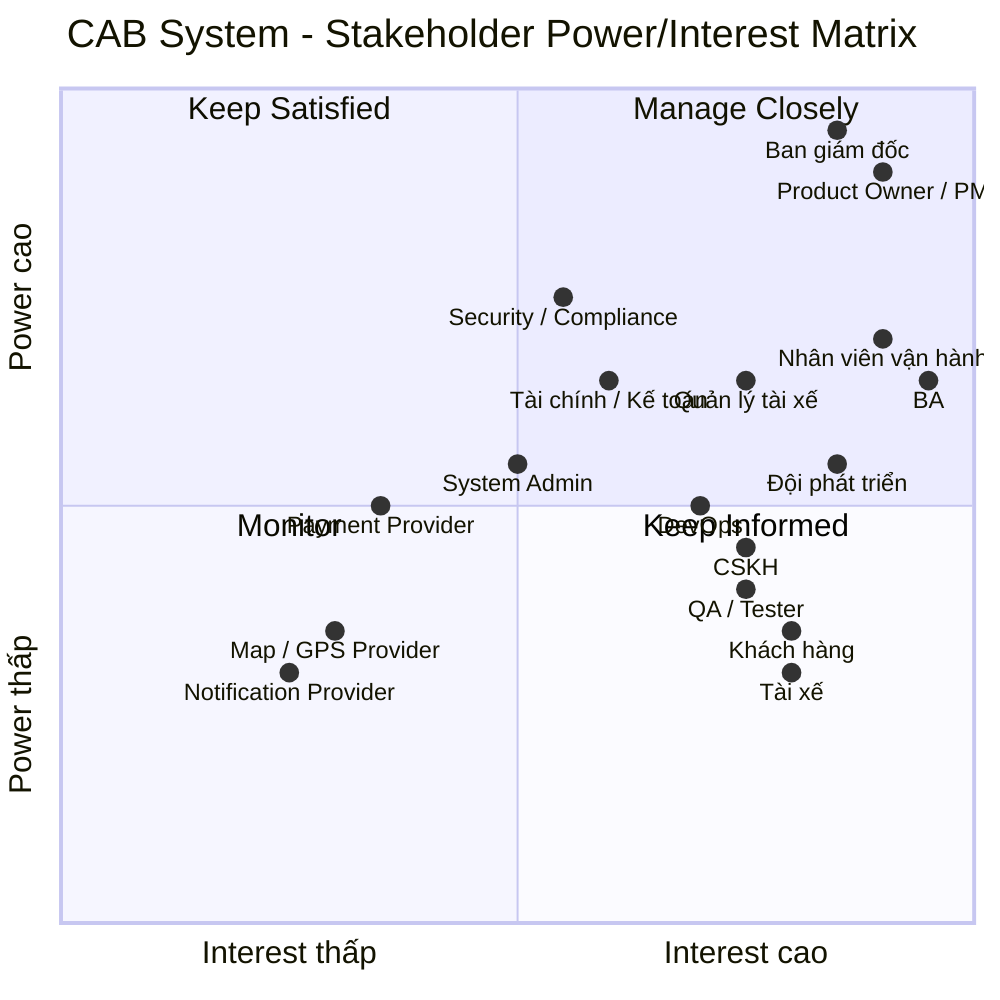

# 23642081_TRANBICHTHUAN_CABSYSTEM
# Bước 1: Xác định yêu cầu hệ thống:
 Yếu điểm hệ thống hiện tại: việc phân công tài xế chủ yếu được thực hiện thủ công, khách hàng khó theo dõi trạng thái chuyến đi, thông tin thanh toán chưa được quản lý tập trung và bộ phận vận hành gặp khó khăn khi muốn mở rộng hệ thống
 Muốn xây dựng một nền tảng CAB mới có khả năng phục vụ số lượng lớn khách hàng và tài xế, đồng thời có thể phát triển thêm các tính năng trong tương lai.
 Người dùng chính: khách hàng, tài xế, nhân viên vận hành
 Yêu cầu chức năng:
### - Khách hàng:
### + Đăng ký tài khoản
### + Đăng nhập
### + Cập nhật thông tin cá nhân
### + Nhập điểm đón và điểm đến
### + Lựa chọn loại xe
### + Gửi yêu cầu đặt xe 
### + Theo dõi chuyến đi
### + Xem thông tin chuyến xe đã đặt
### + Xem lịch sử chuyến đi 
### + Xem số tiền phải trả
### + Đánh giá tài xế sau khi hoàn thành chuyến
### + Nhận được thông báo 

# Bước 2: Xác định các bên liên quan:
| Tên | Vai trò |
|---|---|
| Ban giám đốc / Chủ doanh nghiệp | Nhà tài trợ và người ra quyết định; xác định mục tiêu kinh doanh, phạm vi, ngân sách, KPI và định hướng phát triển hệ thống. |
| Khách hàng | Người sử dụng dịch vụ; đăng ký, đặt xe, theo dõi chuyến, thanh toán, xem lịch sử và đánh giá tài xế. |
| Tài xế | Người cung cấp dịch vụ vận chuyển; nhận/từ chối chuyến, cập nhật trạng thái chuyến, chia sẻ vị trí và hoàn thành chuyến. |
| Nhân viên vận hành | Quản lý hoạt động đặt xe và điều phối; theo dõi chuyến, trạng thái tài xế, xử lý chuyến lỗi và hỗ trợ điều phối khi cần. |
| Quản trị viên hệ thống | Quản lý tài khoản, phân quyền, cấu hình và các hoạt động quản trị kỹ thuật của hệ thống. |
| Bộ phận chăm sóc khách hàng | Tiếp nhận và xử lý yêu cầu hỗ trợ, khiếu nại, vấn đề liên quan đến chuyến đi và thanh toán. |
| Bộ phận tài chính / kế toán | Quản lý doanh thu, giao dịch, đối soát thanh toán và các báo cáo tài chính liên quan. |
| Bộ phận quản lý tài xế / phương tiện | Quản lý hồ sơ tài xế, thông tin phương tiện, trạng thái hoạt động và hiệu quả của tài xế. |
| Bộ phận bảo mật / Compliance | Đảm bảo an toàn dữ liệu, kiểm soát quyền truy cập, audit log và các yêu cầu tuân thủ. |
| Business Analyst (BA) | Thu thập và phân tích yêu cầu, xác định quy trình nghiệp vụ, business rules, ngoại lệ và làm rõ các vấn đề chưa được xác định. |
| Product Owner / Project Manager | Quản lý phạm vi, ưu tiên yêu cầu, kế hoạch triển khai và phối hợp giữa các bên liên quan. |
| Đội phát triển phần mềm | Thiết kế và xây dựng hệ thống dựa trên yêu cầu nghiệp vụ và yêu cầu kỹ thuật. |
| QA / Tester | Kiểm thử hệ thống, đảm bảo các chức năng đáp ứng yêu cầu và hệ thống hoạt động ổn định. |
| DevOps / Infrastructure Team | Triển khai, giám sát, vận hành hạ tầng và đảm bảo khả năng mở rộng, tính sẵn sàng của hệ thống. |
| Nhà cung cấp dịch vụ thanh toán | Xử lý các giao dịch thanh toán điện tử và trả kết quả giao dịch cho CAB System. |
| Nhà cung cấp dịch vụ bản đồ / GPS | Cung cấp dữ liệu vị trí, khoảng cách, định tuyến và hỗ trợ tính thời gian dự kiến đến (ETA). |
| Nhà cung cấp dịch vụ thông báo | Gửi thông báo đến khách hàng và tài xế qua các kênh như Push Notification, SMS hoặc Email. |
## Stakeholder Matrix:

# Bước 3: Business Purpose:
Mục đích	Ý nghĩa kinh doanh
1. Tự động hóa việc đặt xe: Giảm việc tiếp nhận và điều phối chuyến thủ công qua tổng đài
2. Tự động tìm tài xế:	Tìm tài xế phù hợp dựa trên vị trí, trạng thái và tiêu chí vận hành
3. Nâng cao trải nghiệm khách hàng:	Cho phép khách hàng theo dõi tài xế, trạng thái chuyến và ETA
4. Quản lý tập trung:	Tập trung dữ liệu khách hàng, tài xế, phương tiện, chuyến đi và thanh toán
5. Tối ưu vận hành:	Giúp nhân viên vận hành theo dõi và xử lý chuyến theo thời gian thực
6. Chuẩn hóa thanh toán:	Hỗ trợ tiền mặt và thanh toán điện tử, đồng thời tích hợp Payment Provider an toàn
7. Tăng khả năng mở rộng:	Có thể phục vụ nhiều khách hàng/tài xế hơn và mở rộng các thành phần độc lập
8. Hỗ trợ ra quyết định:	Cung cấp dữ liệu về chuyến, doanh thu, tỷ lệ hoàn thành/hủy và hiệu quả tài xế
9. Tăng tính an toàn và kiểm soát:	Phân quyền, bảo vệ dữ liệu và lưu vết các thao tác quan trọng
10. Tạo nền tảng phát triển lâu dài:	Dễ bổ sung loại dịch vụ, phương thức thanh toán và kênh thông báo mới
# Bước 4: Xác định phạm vi:
 Quản lý khách hàng
 Quản lý tài xế
 Quản lý chuyến
 Tính cước
 Quản lý Đặt xe & tìm tài xế
 Quản lý Thanh toán
 Quản lý Thông báo
 Quản lý Nhân viên vận hành
 Bảo mật cơ bản
# Bước 5: Chuyển các yêu cầu thành yêu cầu nghiệp vụ:
| ID | Yêu cầu nghiệp vụ |
|---|---|
| BR-01 | Doanh nghiệp cần một hệ thống đặt xe trực tuyến cho phép khách hàng tự tạo và quản lý yêu cầu đặt xe mà không cần phụ thuộc hoàn toàn vào tổng đài. |
| BR-02 | Hệ thống phải cho phép khách hàng đăng ký, đăng nhập và quản lý thông tin tài khoản để sử dụng dịch vụ đặt xe. |
| BR-03 | Hệ thống phải cho phép khách hàng cung cấp điểm đón, điểm đến và loại xe để tạo yêu cầu đặt xe. |
| BR-04 | Hệ thống phải tự động tiếp nhận và xử lý yêu cầu đặt xe của khách hàng. |
| BR-05 | Hệ thống phải hỗ trợ tìm kiếm và lựa chọn tài xế phù hợp dựa trên trạng thái sẵn sàng và vị trí của tài xế. |
| BR-06 | Hệ thống phải tự động tiếp tục tìm tài xế khác khi tài xế được đề xuất từ chối hoặc không phản hồi trong thời gian quy định. |
| BR-07 | Hệ thống phải thông báo cho khách hàng khi không tìm được tài xế phù hợp. |
| BR-08 | Hệ thống phải cho phép tài xế đăng nhập, cập nhật thông tin cá nhân, phương tiện và trạng thái sẵn sàng nhận chuyến. |
| BR-09 | Hệ thống phải cho phép tài xế nhận hoặc từ chối yêu cầu chuyến xe. |
| BR-10 | Hệ thống phải cho phép tài xế cập nhật trạng thái trong quá trình thực hiện chuyến. |
| BR-11 | Hệ thống phải cho phép khách hàng theo dõi trạng thái chuyến và thông tin tài xế sau khi chuyến được phân công. |
| BR-12 | Hệ thống phải quản lý toàn bộ vòng đời của chuyến xe từ lúc tạo yêu cầu đến khi chuyến hoàn thành hoặc bị hủy. |
| BR-13 | Hệ thống phải tính được số tiền khách hàng cần thanh toán dựa trên loại xe và thông tin chuyến đi theo chính sách giá của doanh nghiệp. |
| BR-14 | Hệ thống phải hỗ trợ thanh toán tiền mặt và ghi nhận trạng thái thanh toán của chuyến. |
| BR-15 | Hệ thống phải cung cấp thông báo cho khách hàng và tài xế khi xảy ra các sự kiện quan trọng trong quá trình đặt và thực hiện chuyến. |
| BR-16 | Hệ thống phải cho phép khách hàng xem lịch sử các chuyến đã thực hiện và số tiền tương ứng. |
| BR-17 | Hệ thống phải cung cấp giao diện cơ bản cho nhân viên vận hành để theo dõi chuyến đang diễn ra và thông tin tài xế. |
| BR-18 | Nhân viên vận hành phải có khả năng hỗ trợ xử lý các trường hợp chuyến gặp lỗi hoặc cần can thiệp. |
| BR-19 | Hệ thống phải phân biệt quyền sử dụng giữa khách hàng, tài xế và nhân viên vận hành để đảm bảo mỗi nhóm chỉ thực hiện được các nghiệp vụ phù hợp. |
| BR-20 | Hệ thống phải bảo vệ thông tin cá nhân của khách hàng, tài xế và thông tin chuyến đi trong quá trình sử dụng dịch vụ. |
# Bước 6: Phân rã các yêu cầu chức năng:

1. Quản lý tài khoản khách hàng
2. Đặt xe
3. Tìm và phân công tài xế
4. Quản lý tài xế
5. Nhận và thực hiện chuyến
6. Theo dõi chuyến
7. Tính cước
8. Thanh toán
# Bước 7: Usecase diagram:
# Bước 8: Đặc tả Usecase:
# Bước 9: Phân tích quy trình nghiệp vụ:

# Bước 10: Phân tích quy tắc nghiệp vụ:
ví dụ: những tài xế có rating cao sẽ được ưu tiên,hoặc những người sẵn sàn

