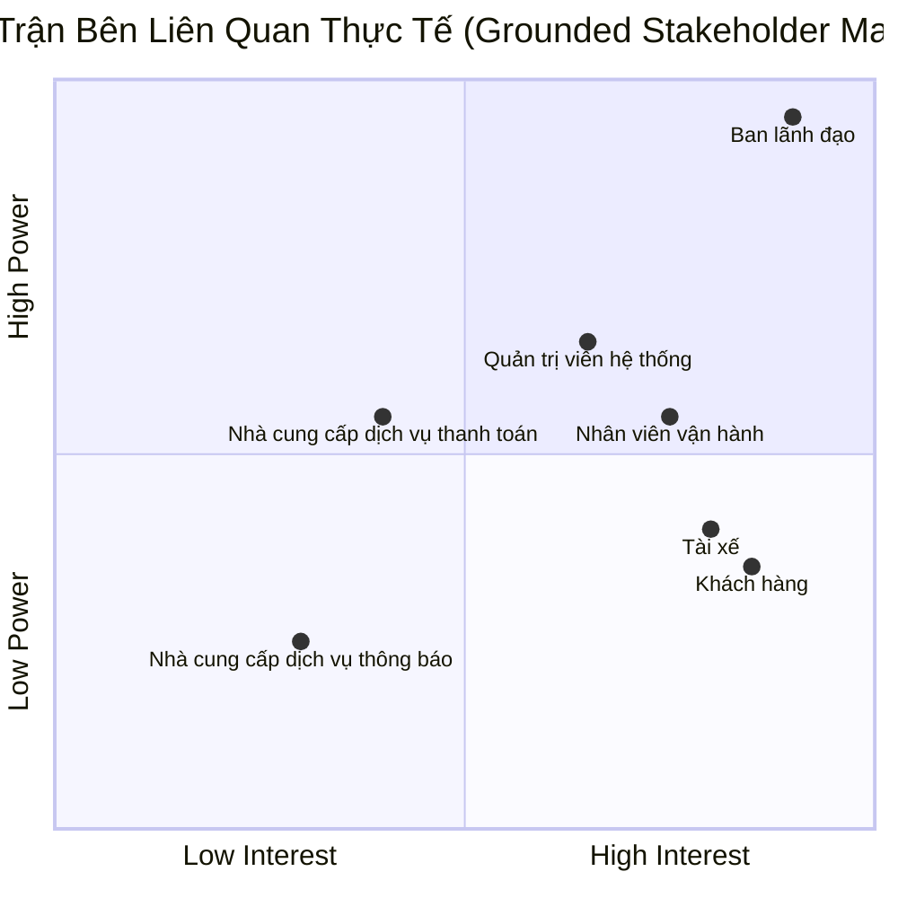

# 23642081_TRANBICHTHUAN_CABSYSTEM
# Bước 1: Xác định yêu cầu hệ thống:
* **Tên hệ thống:** CAB System – Nền tảng đặt xe

* **Vấn đề hệ thống hiện tại:** Hệ thống hiện tại còn nhiều hạn chế như phân công tài xế chủ yếu thủ công, khách hàng khó theo dõi trạng thái chuyến đi, thông tin thanh toán chưa được quản lý tập trung và hệ thống khó mở rộng khi số lượng khách hàng, tài xế tăng lên. Do đó, doanh nghiệp cần xây dựng một nền tảng CAB mới để tự động hóa và nâng cao hiệu quả vận hành.

* **Mục tiêu:** Xây dựng một nền tảng đặt xe trực tuyến giúp khách hàng đặt xe, hệ thống tự động tìm và phân công tài xế, hỗ trợ tài xế thực hiện chuyến, thanh toán và thông báo, đồng thời cung cấp giao diện quản trị cho nhân viên vận hành. Hệ thống được định hướng trở thành một nền tảng CAB có khả năng mở rộng lâu dài, không chỉ đáp ứng nhu cầu đặt xe hiện tại mà còn cho phép bổ sung loại dịch vụ, phương thức thanh toán, nhà cung cấp thông báo và các thành phần kỹ thuật trong tương lai.

# Bước 2: Xác định các bên liên quan:
| Tên | Vai trò |
|---|---|
| Ban lãnh đạo | Theo dõi hoạt động kinh doanh thông qua các báo cáo về số lượng chuyến, doanh thu, tỷ lệ hoàn thành, tỷ lệ hủy và hiệu quả tài xế. |
| Khách hàng | Người sử dụng dịch vụ; đăng ký, đặt xe, theo dõi chuyến, thanh toán, xem lịch sử và đánh giá tài xế. |
| Tài xế | Nhận và thực hiện chuyến xe; quản lý hồ sơ, phương tiện, trạng thái hoạt động, cập nhật trạng thái chuyến đi, chia sẻ vị trí và hoàn thành chuyến. |
| Nhân viên vận hành | Quản lý hoạt động đặt xe và điều phối; theo dõi chuyến, trạng thái tài xế, xử lý chuyến lỗi và hỗ trợ điều phối khi cần. |
| Quản trị viên hệ thống | Quản lý tài khoản, phân quyền, cấu hình và các hoạt động quản trị kỹ thuật của hệ thống. |
| Nhà cung cấp dịch vụ thanh toán | Xử lý các giao dịch thanh toán điện tử và trả kết quả giao dịch cho CAB System. |
| Nhà cung cấp dịch vụ thông báo | Gửi thông báo đến khách hàng và tài xế qua các kênh như Push Notification, SMS hoặc Email. |
## Stakeholder Matrix:

# Bước 3: Mục đích kinh doanh (Business Purpose):
Mục đích	Ý nghĩa kinh doanh

**1. Tự động hóa & Số hóa:** Chuẩn hóa và tự động hóa toàn bộ quy trình cung cấp dịch vụ: từ khâu tiếp nhận yêu cầu đặt xe, tìm kiếm & điều phối tài xế tự động, thực hiện hành trình, tính cước, xử lý thanh toán, gửi thông báo thời gian thực đến thu thập phản hồi đánh giá của khách hàng. Đồng thời cho phép khách hàng theo dõi tài xế, trạng thái chuyến và ETA

**2. Hỗ trợ ra quyết định dựa trên dữ liệu:** Tập trung hóa và chuẩn hóa toàn bộ dữ liệu giao dịch, hành trình và vận hành. Đảm bảo các bộ phận có đủ dữ liệu chính xác để theo dõi hoạt động, đồng thời cung cấp cho Ban lãnh đạo hệ thống báo cáo trực quan về hiệu suất kinh doanh (doanh thu, số lượng chuyến, tỷ lệ hoàn thành, tỷ lệ hủy và hiệu quả hoạt động của tài xế), làm cơ sở đưa ra các quyết định chiến lược và điều chỉnh chính sách kịp thời.

**3. Tối ưu năng lực phục vụ tải lớn:** Xây dựng một nền tảng mạnh mẽ có khả năng phục vụ đồng thời số lượng lớn khách hàng và đối tác tài xế, đảm bảo hệ thống vận hành liên tục, ổn định ngay cả vào các khung giờ cao điểm có nhu cầu tăng cao.

**4. Xây dựng nền tảng phát triển dài hạn:** Sở hữu một giải pháp công nghệ có cấu trúc linh hoạt, có khả năng mở rộng độc lập và triển khai từng phần, dễ dàng bổ sung thêm các loại dịch vụ mới, tích hợp thêm cổng thanh toán hoặc thay đổi nhà cung cấp dịch vụ thông báo trong tương lai mà không cần phải tái cấu trúc toàn bộ hệ thống.

**5. Tối ưu hóa vận hành thời gian thực:** Cung cấp cho bộ phận vận hành giao diện quản trị tập trung để theo dõi sát sao các chuyến đi đang diễn ra, kiểm tra trạng thái hoạt động thực tế của tài xế và hỗ trợ can thiệp, xử lý kịp thời các trường hợp chuyến đi bị lỗi ngay khi sự cố phát sinh theo thời gian thực.

**6. Tăng cường an toàn, kiểm soát và bảo mật:**	Xác thực & Phân quyền chặt chẽ, bảo vệ dữ liệu và lưu vết các thao tác quan trọng

# Bước 4: Xác định phạm vi:

 | Nhóm chức năng | Mô tả phạm vi  | Ghi chú kỹ thuật & Nghiệp vụ |
| :--- | :--- | :--- |
| **Quản lý tài khoản & Xác thực** | • Khách hàng tự đăng ký tài khoản, đăng nhập và cập nhật thông tin cá nhân. • Tài xế đăng ký hoặc được nhân viên vận hành tạo tài khoản, cập nhật hồ sơ, thông tin phương tiện và trạng thái hoạt động. • Khách hàng và tài xế bắt buộc phải được xác thực trước khi sử dụng các chức năng yêu cầu tài khoản. | Yêu cầu an toàn thông tin cơ bản để bảo vệ thông tin cá nhân và dữ liệu giao dịch. |
| **Đặt xe** | • Khách hàng nhập thông tin điểm đón, điểm đến, lựa chọn loại xe và gửi yêu cầu đặt xe. | Luồng tạo yêu cầu dịch vụ cốt lõi. |
| **Tìm & Phân công tài xế** | • Hệ thống tự động quét và xác định danh sách tài xế phù hợp dựa trên vị trí, trạng thái sẵn sàng và loại xe. • **Cơ chế tự động chuyển tiếp:** Nếu tài xế được đề xuất đầu tiên từ chối hoặc không phản hồi (timeout), hệ thống tự động tìm và chuyển yêu cầu sang tài xế tiếp theo mà không bắt khách hàng đặt lại. • Nếu không tìm được tài xế, hệ thống gửi thông báo rõ ràng cho khách hàng. | Thuật toán chạy ngầm, cần được tối ưu xử lý bất đồng bộ để tránh tắc nghẽn luồng đặt xe cốt lõi. |
| **Quản lý chuyến đi** | • Khách hàng biết trạng thái hệ thống đang tìm tài xế, tài xế nào đã nhận chuyến, thời gian dự kiến đến và trạng thái chuyến đi. • Tài xế cập nhật trạng thái theo từng giai đoạn: đã đến điểm đón, đã đón khách, đang di chuyển và hoàn thành chuyến. | Khắc phục hạn chế của hệ thống cũ, giúp khách hàng chủ động theo dõi hành trình thời gian thực. |
| **Vị trí tài xế** | • Hệ thống lưu thông tin vị trí của tài xế để hỗ trợ tìm tài xế gần khách hàng và ước tính thời gian đến. • *Không tích hợp bản đồ trực quan (Map Provider) trên giao diện ứng dụng ở giai đoạn này.* | Lưu trữ vị trí trực tiếp vào cơ sở dữ liệu để tính khoảng cách toán học thuần túy (như công thức Haversine) giữa các tọa độ, tiết kiệm thời gian tích hợp API bản đồ. |
| **Tính cước** | • Tự động xác định số tiền khách hàng phải trả dựa trên loại dịch vụ và thông tin chuyến đi ngay khi hoàn thành. | Áp dụng công thức tính cước tối giản của MVP do quy tắc tính cước chi tiết hiện chưa được doanh nghiệp thống nhất. |
| **Thanh toán** | • Hỗ trợ thanh toán bằng tiền mặt hoặc thanh toán điện tử. • Tích hợp với **01 nhà cung cấp cổng thanh toán điện tử duy nhất**. • **Tuyệt đối không lưu trữ thông tin nhạy cảm** của thẻ hoặc tài khoản thanh toán trên hệ thống CAB. • Nếu giao dịch điện tử thất bại, thông báo cho khách hàng và cho phép xử lý lại theo chính sách của doanh nghiệp. | Đảm bảo tính bảo mật và toàn vẹn của dữ liệu giao dịch tài chính. |
| **Thông báo** | • Gửi thông báo tự động cho khách hàng tại các điểm chạm cốt lõi (Tiếp nhận đặt xe, Có tài xế nhận, Tài xế đến điểm đón, Chuyến hoàn thành, Kết quả thanh toán). • Gửi thông báo cho tài xế về chuyến mới hoặc các thay đổi liên quan đến chuyến đang thực hiện. | Module thông báo được thiết kế độc lập để dễ dàng mở rộng thêm các kênh mới trong tương lai mà không phải thay đổi toàn hệ thống. |
| **Lịch sử & Đánh giá** | • Khách hàng xem lại lịch sử chuyến đi, số tiền đã trả. • Khách hàng thực hiện đánh giá (Rating) chất lượng dịch vụ của tài xế sau khi hoàn thành chuyến. | Thu thập phản hồi chất lượng dịch vụ phục vụ công tác nâng cao trải nghiệm. |
| **Quản lý vận hành** | • Giao diện quản trị giúp nhân viên vận hành quản lý khách hàng, tài xế, phương tiện và chuyến đi. • Xem danh sách các chuyến đi đang diễn ra, trạng thái hoạt động của tài xế và tra cứu lịch sử giao dịch. • Cung cấp tính năng hỗ trợ xử lý các trường hợp chuyến đi bị lỗi kỹ thuật hoặc nghiệp vụ . | Phục vụ hoạt động điều phối, kiểm soát hàng ngày và hỗ trợ khách hàng của phòng vận hành. |
| **Phân quyền (RBAC)** | • Kiểm soát quyền truy cập đối với các chức năng quản trị. • Phân quyền rõ ràng để nhân viên vận hành thông thường không thể thực hiện các thao tác nhạy cảm. | Đảm bảo an toàn vận hành, tránh rủi ro thao tác sai lệch dữ liệu quản trị. |
| **Audit Log** | • Ghi nhận và lưu vết toàn bộ các thao tác quản trị quan trọng. | Yêu cầu bảo mật bắt buộc để phục vụ công tác kiểm tra, đối soát khi xảy ra sự cố. |
| **Báo cáo cơ bản** | • Cung cấp báo cáo về số lượng chuyến, doanh thu, tỷ lệ chuyến hoàn thành và tỷ lệ hủy. | Hỗ trợ Ban lãnh đạo theo dõi hiệu quả hoạt động kinh doanh và hiệu quả hoạt động của tài xế. |

---
# Bước 5: Chuyển các yêu cầu thành yêu cầu nghiệp vụ (Business Requirements):
## Danh sách Yêu cầu Nghiệp vụ (BR)

---

| Mã BR | Yêu cầu Nghiệp vụ cốt lõi | KPI & Tiêu chí Nghiệm thu cụ thể |
| :--- | :--- | :--- |
| **BR-01** | Tự động hóa ghép chuyến & Phân công tài xế | • **100%** luồng phân công chạy tự động, không cần tổng đài can thiệp. • Thời gian phản hồi ghép chuyến $\le$ **15s/vòng quét**. • Tự động chuyển tiếp tìm tài xế khác khi tài xế trước từ chối hoặc timeout mà không bắt khách tạo lại chuyến. |
| **BR-02** | Minh bạch hành trình & Trạng thái real-time | • Hiển thị chuẩn xác **5 trạng thái** vòng đời chuyến đi (*Tìm tài xế, Đã nhận chuyến, Đến điểm đón, Đang di chuyển, Hoàn thành*). • Cập nhật thời gian dự kiến đến (ETA) với sai số $\le$ **$\pm$ 3 phút**. • Tự động gửi **100%** thông báo đẩy (Push/SMS) đúng 5 mốc sự kiện cốt lõi. |
| **BR-03** | Chuẩn hóa & An toàn luồng Thanh toán | • Tự động tính cước chính xác ngay khi hoàn thành chuyến đi. • **0%** lưu trữ thông tin thẻ nhạy cảm (CVV, số thẻ đầy đủ) trên hệ thống CAB. • Cho phép khách hàng chọn thanh toán lại (Retry) hoặc đổi sang tiền mặt ngay khi giao dịch điện tử thất bại. |
| **BR-04** | Giám sát & Xử lý sự cố Vận hành | • Nhân viên vận hành có thể tra cứu và can thiệp xử lý chuyến lỗi trong vòng $\le$ **2 phút**. • **100%** thao tác nhạy cảm của nhân viên (phân quyền, chỉnh sửa dữ liệu) phải được lưu Audit Log đầy đủ. |
| **BR-05** | Hệ thống Báo cáo Quản trị | • Cung cấp đủ 5 nhóm chỉ số: *Doanh thu, Số lượng chuyến, Tỷ lệ hoàn thành, Tỷ lệ hủy, KPI hiệu suất tài xế*. • Tốc độ xuất báo cáo dữ liệu trong vòng 30 ngày đạt $\le$ **5 giây**. |
| **BR-06** | Cách ly lỗi & Khả năng Mở rộng | • **0% Downtime** luồng Đặt xe cốt lõi khi Module Thanh toán hoặc Thông báo gặp sự cố kỹ thuật. • Kiến trúc linh hoạt, cho phép cắm/rút cổng thanh toán hoặc thêm loại dịch vụ mới mà không phải làm lại hệ thống. |

# Bước 6: Phân rã các yêu cầu chức năng (Functional Requirements):

---

## 1. Actor: Khách hàng

* **Đăng ký & Đăng nhập:** Khách hàng đăng ký/đăng nhập tài khoản bằng Số điện thoại + OTP.
* **Quản lý Hồ sơ:** Khách hàng xem và cập nhật thông tin cá nhân (Họ tên, Email).
* **Đặt xe:** Khách hàng nhập Điểm đón, Điểm đến, chọn Loại xe và xem Giá cước dự kiến trước khi xác nhận đặt xe.
* **Theo dõi Chuyến đi:** Khách hàng xem trạng thái chuyến đi, vị trí tài xế di chuyển và Thời gian dự kiến đến (ETA).
* **Thanh toán** Khách hàng thực hiện thanh toán qua Cổng điện tử hoặc Tiền mặt.
* **Xem Lịch sử & Đánh giá:** Khách hàng tra cứu lịch sử chuyến đi và chấm điểm sao (1-5 sao) kèm nhận xét về tài xế.

## 2. Actor: Tài xế

* **Đăng ký Hồ sơ & Xe:** Tài xế tự đăng ký tài khoản, cập nhật hồ sơ cá nhân và thông tin phương tiện (Biển số, Loại xe).
* **Quản lý Trạng thái Hoạt động:** Tài xế chuyển đổi trạng thái "Sẵn sàng nhận chuyến" hoặc "Tắt ứng dụng".
* **Tiếp nhận / Từ chối Chuyến:** Tài xế nhận thông báo chuyến đi mới và bấm Chấp nhận hoặc Từ chối trong thời gian quy định.
* **Cập nhật Tiến độ Chuyến đi:** Tài xế cập nhật trạng thái theo luồng: *Đã đến điểm đón -> Đã đón khách -> Hoàn thành chuyến*.
* **Xem Lịch sử Chuyến đi:** Tài xế tra cứu các chuyến đã thực hiện và tổng số tiền thu nhập.

## 3. Actor: Nhân viên Vận hành 

* **Quản lý Hồ sơ Khách hàng:** Tìm kiếm, xem chi tiết thông tin tài khoản Khách hàng.
* **Quản lý Hồ sơ Tài xế & Xe:** Tạo mới tài khoản Tài xế, cập nhật hồ sơ và thông tin phương tiện (biển số, loại xe).
* **Giám sát Chuyến đi:** Theo dõi danh sách các chuyến đi đang diễn ra và vị trí/trạng thái thực tế của Tài xế.
* **Xử lý Chuyến lỗi:** Can thiệp hủy chuyến hoặc điều chỉnh trạng thái khi chuyến đi gặp sự cố kỹ thuật/nghiệp vụ.
* **Tra cứu Lịch sử Giao dịch:** Tra cứu lịch sử chuyến đi và chi tiết các giao dịch thanh toán để hỗ trợ CSKH.

## 4. Actor: Quản trị viên Hệ thống

* **Phân quyền Truy cập (RBAC):** Cấu hình vai trò và phân quyền thao tác cho Nhân viên Vận hành, ngăn chặn truy cập chức năng nhạy cảm.
* **Tra cứu Nhật ký Audit Log:** Xem lịch sử lưu vết toàn bộ thao tác quan trọng của người dùng nội bộ để phục vụ đối soát khi có sự cố.

## 5. Actor: Ban Lãnh đạo

* **Xem Báo cáo:** Xem báo cáo thống kê về tổng số chuyến, doanh thu, tỷ lệ chuyến hoàn thành và tỷ lệ hủy chuyến.Tra cứu các chỉ số KPI đánh giá hiệu suất hoạt động của đội ngũ tài xế.
  
# Bước 7: Usecase diagram:
# Bước 8: Đặc tả Usecase:
# Bước 9: Phân tích quy trình nghiệp vụ:

# Bước 10: Phân tích quy tắc nghiệp vụ:
ví dụ: những tài xế có rating cao sẽ được ưu tiên,hoặc những người sẵn sàn

